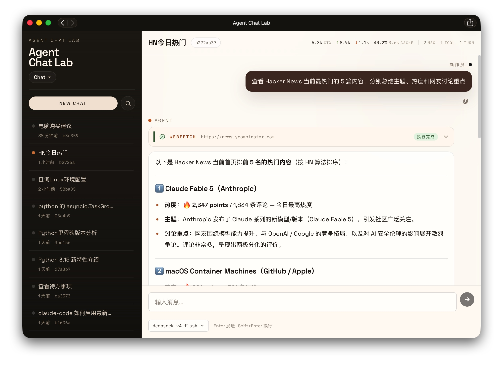
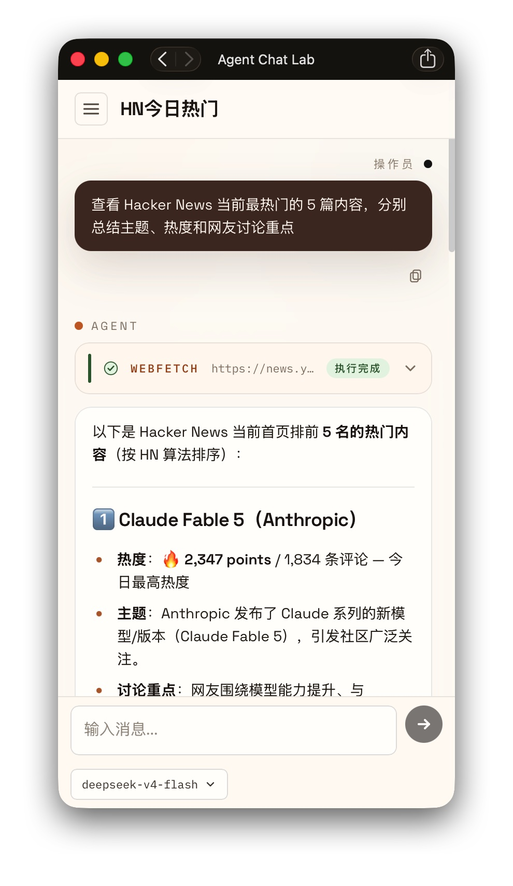

# Agent Chat Lab

一个用于学习 Agent 构建流程的 Next.js Web 应用，包含聊天、工具调用和基础记忆。

- **Chat UI**：流式回复、工具调用卡片、Agent timeline、token 统计
- **内置工具**：计算器、笔记、TODO、Tavily 搜索/抓取、受审批保护的 Bash
- **模型配置**：支持多供应商（OpenAI 兼容 / Anthropic）、模型列表拉取、settings 页面管理
- **MCP**：支持配置远程 Streamable HTTP MCP Server
- **持久化**：SQLite + Drizzle 保存会话、消息、笔记、TODO 和设置
- **安全**：静态密码登录，proxy 层统一保护

## 界面预览

<table>
  <tr>
    <td width="65%"></td>
    <td width="35%"></td>
  </tr>
  <tr>
    <td align="center">桌面端：会话列表、工具调用卡片、token 统计</td>
    <td align="center">移动端：自适应窄屏布局</td>
  </tr>
</table>

## 快速开始

```bash
pnpm install
cp .env.example .env.local
pnpm dev
```

启动前配置 `AUTH_PASSWORD`、`OPENAI_BASE_URL`、`OPENAI_API_KEY`、`OPENAI_MODEL`。访问 `http://localhost:3000` 登录后，可在 `/settings` 调整模型、Tavily 和 MCP。

## Docker

```bash
cp .env.example .env
mkdir -p data workspace
docker compose up -d
```

如遇到数据目录权限错误，可执行：

```bash
sudo chown -R 1000:1000 data workspace
```

## 入口

| 路径 | 功能 |
|------|------|
| `/` | 聊天 |
| `/todos` | TODO 管理 |
| `/settings` | 供应商 / Tavily / MCP 配置 |
| `/login` | 登录 |

## 项目结构

```
app/           页面和 API routes
components/    UI 组件
lib/ai/        模型、工具、MCP、系统提示词
lib/db/        Drizzle schema 与 SQLite
drizzle/       数据库迁移
data/          运行时 SQLite 数据
workspace/     Docker Bash 工作目录
```

## 验证

```bash
pnpm lint
pnpm build
```
