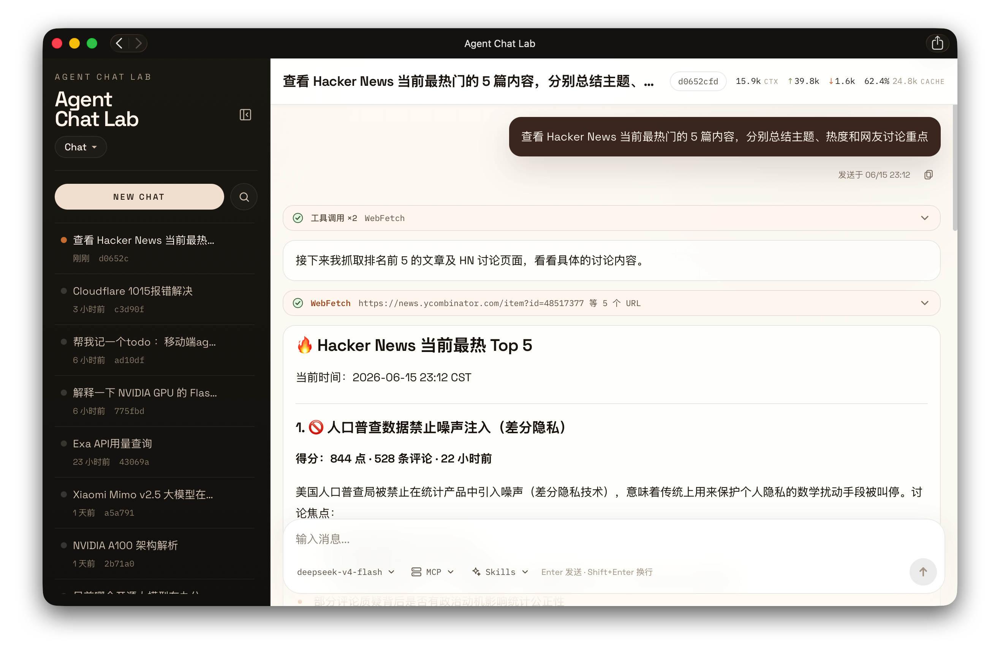

# Agent Chat Lab

English | [中文](README.zh-CN.md)

A Next.js web app for learning how to build agents, featuring chat, tool calling, and basic memory.

- **Chat UI**: streaming responses, tool-call cards, agent timeline, token stats
- **Built-in tools**: calculator, notes, TODO, Tavily search/fetch, approval-gated Bash
- **Model configuration**: multi-provider support (OpenAI-compatible / Anthropic), model list fetching, management via the settings page
- **MCP**: configure remote Streamable HTTP MCP servers
- **Persistence**: SQLite + Drizzle for conversations, messages, notes, TODOs, and settings
- **Security**: static password login, unified protection at the proxy layer

## Screenshots

<table>
  <tr>
    <td width="65%"></td>
    <td width="35%"></td>
  </tr>
  <tr>
    <td align="center">Desktop: conversation list, tool-call cards, token stats</td>
    <td align="center">Mobile: responsive narrow-screen layout</td>
  </tr>
</table>

## Quick Start

```bash
pnpm install
cp .env.example .env.local
pnpm dev
```

Before starting, configure `AUTH_PASSWORD`, `OPENAI_BASE_URL`, `OPENAI_API_KEY`, and `OPENAI_MODEL`. Visit `http://localhost:3000`, log in, and adjust the model, Tavily, and MCP settings under `/settings`.

## Docker

```bash
cp .env.example .env
mkdir -p data workspace
docker compose up -d
```

If you hit a permission error on the data directories, run:

```bash
sudo chown -R 1000:1000 data workspace
```

## Routes

| Path | Purpose |
|------|---------|
| `/` | Chat |
| `/todos` | TODO management |
| `/settings` | Provider / Tavily / MCP configuration |
| `/login` | Login |

## Project Structure

```
app/           Pages and API routes
components/    UI components
lib/ai/        Models, tools, MCP, system prompt
lib/db/        Drizzle schema and SQLite
drizzle/       Database migrations
data/          Runtime SQLite data
workspace/     Docker Bash working directory
```

## Validation

```bash
pnpm lint
pnpm build
```
